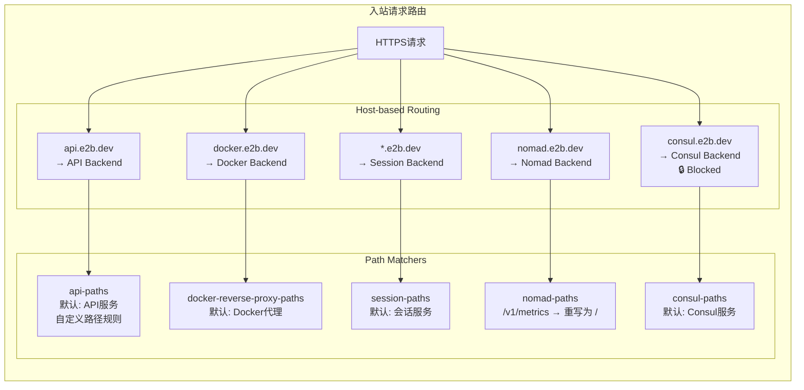
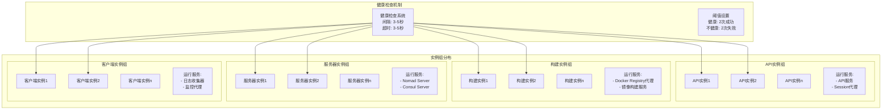

# E2B 集群网络架构详细图解

## 网络架构总览

```mermaid
graph TB
    subgraph "互联网用户"
        User[用户/开发者]
        Bot[自动化客户端]
    end
    
    subgraph "DNS 层 (Cloudflare)"
        CF_DNS[Cloudflare DNS<br/>*.e2b.dev]
        CF_Records[DNS记录<br/>A记录: *.domain → GLB IP<br/>TXT记录: 证书验证]
    end
    
    subgraph "Google Cloud 全球负载均衡层"
        GLB_IP[全球Anycast IP<br/>google_compute_global_forwarding_rule]
        HTTPS_Proxy[HTTPS代理<br/>google_compute_target_https_proxy<br/>端口: 443]
        SSL_Cert[SSL证书管理<br/>google_certificate_manager<br/>*.domain.com 通配符证书]
        URL_Map[URL映射<br/>google_compute_url_map<br/>基于Host的路由]
    end
    
    subgraph "安全策略层"
        WAF[Web应用防火墙]
        DDoS[Layer 7 DDoS防护<br/>仅API服务启用]
        RateLimit[速率限制规则<br/>- API Key: 1200/10s<br/>- IP: 20000/30s<br/>- Session: 40000/60s]
        SecurityPolicy[安全策略<br/>google_compute_security_policy]
    end
    
    subgraph "后端服务层 (Backend Services)"
        subgraph "API服务"
            API_Backend[API Backend<br/>端口: 49160<br/>超时: 65s]
            API_IG[API实例组<br/>api_instance_group]
        end
        
        subgraph "会话服务"
            Session_Backend[Session Backend<br/>端口: 3000<br/>超时: 86400s (24h)]
            Session_IG[会话实例组<br/>api_instance_group]
        end
        
        subgraph "Docker服务"
            Docker_Backend[Docker Reverse Proxy<br/>端口: 3003<br/>超时: 30s]
            Docker_IG[构建实例组<br/>build_instance_group]
        end
        
        subgraph "集群管理"
            Nomad_Backend[Nomad Backend<br/>端口: 80→4646<br/>超时: 10s]
            Consul_Backend[Consul Backend<br/>端口: 80→8500<br/>超时: 10s<br/>🔒 完全禁用外部访问]
            Server_IG[服务器实例组<br/>server_instance_group]
        end
    end
    
    subgraph "健康检查"
        HC_API[API健康检查<br/>/health<br/>间隔: 3s]
        HC_Session[Session健康检查<br/>/health<br/>间隔: 3s]
        HC_Docker[Docker健康检查<br/>/health<br/>间隔: 5s]
        HC_Nomad[Nomad健康检查<br/>/v1/status/peers<br/>间隔: 5s]
        HC_Consul[Consul健康检查<br/>/v1/status/peers<br/>间隔: 5s]
    end
    
    subgraph "日志收集系统"
        Logs_LB[日志负载均衡器<br/>google_compute_global_address]
        Logs_Backend[日志收集后端<br/>端口: 8080]
        Client_IG[客户端实例组<br/>client_instance_group]
    end
    
    subgraph "防火墙规则"
        FW_HC[健康检查防火墙<br/>源: 130.211.0.0/22, 35.191.0.0/16]
        FW_SSH[SSH/RDP防火墙<br/>Dev: 0.0.0.0/0<br/>Prod: IAP only]
        FW_Egress[出站防火墙<br/>允许所有出站]
        FW_Logs[日志收集防火墙<br/>端口: 8080, 8081]
    end
    
    %% 连接关系
    User --> CF_DNS
    Bot --> CF_DNS
    CF_DNS --> GLB_IP
    GLB_IP --> HTTPS_Proxy
    HTTPS_Proxy --> SSL_Cert
    HTTPS_Proxy --> URL_Map
    URL_Map --> WAF
    WAF --> DDoS
    DDoS --> RateLimit
    RateLimit --> SecurityPolicy
    
    SecurityPolicy --> API_Backend
    SecurityPolicy --> Session_Backend
    SecurityPolicy --> Docker_Backend
    SecurityPolicy --> Nomad_Backend
    SecurityPolicy --> Consul_Backend
    
    API_Backend --> API_IG
    Session_Backend --> Session_IG
    Docker_Backend --> Docker_IG
    Nomad_Backend --> Server_IG
    Consul_Backend --> Server_IG
    
    HC_API -.-> API_Backend
    HC_Session -.-> Session_Backend
    HC_Docker -.-> Docker_Backend
    HC_Nomad -.-> Nomad_Backend
    HC_Consul -.-> Consul_Backend
    
    User --> Logs_LB
    Logs_LB --> Logs_Backend
    Logs_Backend --> Client_IG
    
    FW_HC -.-> API_IG
    FW_HC -.-> Session_IG
    FW_HC -.-> Docker_IG
    FW_HC -.-> Server_IG
    FW_SSH -.-> Server_IG
    FW_Egress -.-> API_IG
    FW_Egress -.-> Session_IG
    FW_Logs -.-> Client_IG
    
    classDef dns fill:#e1f5fe,stroke:#01579b,stroke-width:2px
    classDef lb fill:#fff3e0,stroke:#e65100,stroke-width:2px
    classDef security fill:#ffebee,stroke:#b71c1c,stroke-width:2px
    classDef backend fill:#f3e5f5,stroke:#4a148c,stroke-width:2px
    classDef health fill:#e8f5e9,stroke:#1b5e20,stroke-width:2px
    classDef firewall fill:#fce4ec,stroke:#880e4f,stroke-width:2px
    
    class CF_DNS,CF_Records dns
    class GLB_IP,HTTPS_Proxy,SSL_Cert,URL_Map,Logs_LB lb
    class WAF,DDoS,RateLimit,SecurityPolicy security
    class API_Backend,Session_Backend,Docker_Backend,Nomad_Backend,Consul_Backend,API_IG,Session_IG,Docker_IG,Server_IG,Logs_Backend,Client_IG backend
    class HC_API,HC_Session,HC_Docker,HC_Nomad,HC_Consul health
    class FW_HC,FW_SSH,FW_Egress,FW_Logs firewall
```

## URL 路由详细映射



## 安全策略详细流程

```mermaid
flowchart TB
    subgraph "请求处理流程"
        Req[入站请求]
        
        subgraph "第1层: DDoS防护"
            DDoS_Check{DDoS检测<br/>仅API启用}
            DDoS_Pass[通过]
            DDoS_Block[阻止]
        end
        
        subgraph "第2层: 速率限制"
            RL_APIKey{API Key限制<br/>1200req/10s}
            RL_IP{IP限制<br/>20000req/30s}
            RL_Session{会话限制<br/>40req/30s per host}
            RL_Pass[通过]
            RL_429[返回429]
        end
        
        subgraph "第3层: 访问控制"
            AC_Check{访问控制检查}
            AC_Consul{是Consul?}
            AC_Metrics{是/v1/metrics?}
            AC_Pass[允许访问]
            AC_403[返回403]
        end
        
        subgraph "第4层: 防火墙"
            FW_Check{防火墙规则}
            FW_HC{健康检查IP?}
            FW_SSH{SSH/RDP请求?}
            FW_Pass[通过]
            FW_Block[阻止]
        end
        
        Backend[后端服务]
    end
    
    Req --> DDoS_Check
    DDoS_Check -->|API服务| DDoS_Pass
    DDoS_Check -->|其他服务| RL_APIKey
    DDoS_Pass --> RL_APIKey
    DDoS_Check -->|异常| DDoS_Block
    
    RL_APIKey -->|检查Header| RL_IP
    RL_APIKey -->|超限| RL_429
    RL_IP -->|检查源IP| RL_Session
    RL_IP -->|超限| RL_429
    RL_Session -->|检查Host| RL_Pass
    RL_Session -->|超限| RL_429
    
    RL_Pass --> AC_Check
    AC_Check --> AC_Consul
    AC_Consul -->|是| AC_403
    AC_Consul -->|否| AC_Metrics
    AC_Metrics -->|是| AC_403
    AC_Metrics -->|否| AC_Pass
    
    AC_Pass --> FW_Check
    FW_Check --> FW_HC
    FW_HC -->|是| FW_Pass
    FW_HC -->|否| FW_SSH
    FW_SSH -->|Dev环境| FW_Pass
    FW_SSH -->|Prod+IAP| FW_Pass
    FW_SSH -->|Prod+外部| FW_Block
    
    FW_Pass --> Backend
```



## 实例组和健康检查架构



## 网络流量路径示例

### 1. API 请求流程
```
用户 → api.e2b.dev → Cloudflare DNS → GLB IP → HTTPS Proxy 
→ SSL终止 → URL Map → API Path Matcher → Security Policy 
→ DDoS检测 → 速率限制 → API Backend → API实例组 → API服务
```

### 2. 沙箱会话连接流程
```
用户 → sandbox-id.e2b.dev → Cloudflare DNS → GLB IP 
→ HTTPS Proxy → SSL终止 → URL Map → Session Path Matcher 
→ Security Policy → 速率限制 → Session Backend 
→ WebSocket升级 → 长连接维持(24小时)
```

### 3. Docker镜像构建流程
```
CI/CD → docker.e2b.dev → Cloudflare DNS → GLB IP 
→ HTTPS Proxy → URL Map → Docker Path Matcher 
→ Security Policy → Docker Backend → 构建实例组 
→ Docker Registry代理
```

### 4. 日志收集流程
```
应用日志 → 日志收集器 → 独立的日志负载均衡器IP 
→ 日志后端服务 → 客户端实例组 → 日志处理
```

## 关键组件作用说明

### 负载均衡层
- **全球负载均衡器 (GLB)**：提供全球Anycast IP，自动路由到最近的区域
- **HTTPS代理**：SSL/TLS终止，证书管理
- **URL映射**：基于域名和路径的智能路由

### 安全层
- **WAF**：Web应用防火墙，防止常见攻击
- **DDoS防护**：Layer 7 DDoS防护，仅对API服务启用
- **速率限制**：多维度限流（API Key、IP、Host）
- **访问控制**：细粒度的服务访问控制

### 后端服务层
- **API Backend**：处理REST API请求，标准HTTP超时
- **Session Backend**：处理WebSocket长连接，24小时超时
- **Docker Backend**：Docker镜像构建和管理
- **Nomad Backend**：集群任务调度管理
- **Consul Backend**：服务发现和配置管理（禁用外部访问）

### 监控层
- **健康检查**：自动检测服务健康状态
- **日志收集**：独立的日志收集系统
- **指标收集**：通过Nomad/Consul暴露的metrics端点

### 网络安全
- **防火墙规则**：精细的入站/出站控制
- **IAP集成**：生产环境的安全远程访问
- **网络隔离**：通过标签和防火墙规则实现服务隔离

## 高可用性设计

1. **多实例组部署**：每个服务都有多个实例
2. **自动故障转移**：健康检查失败自动移除不健康实例
3. **连接排空**：优雅关闭，1秒连接排空时间
4. **全球负载均衡**：跨区域的流量分发
5. **自动扩缩容**：基于负载的实例组自动扩缩容

## 总结

这个网络架构展示了一个高度成熟的企业级云原生系统：
- **全球化**：利用Cloudflare和Google Cloud的全球基础设施
- **安全性**：多层防护，从DDoS到应用层安全
- **可靠性**：健康检查、自动故障转移、多区域部署
- **可扩展性**：基于实例组的水平扩展
- **可观测性**：完整的日志和监控系统

整个架构通过Terraform代码化管理，确保了基础设施的一致性、可重复性和版本控制。