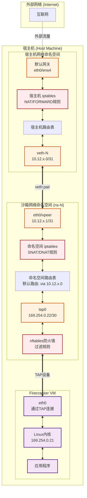

# E2B Firecracker 网络架构分析

## 网络通信模式

E2B 中 Firecracker 虚拟机使用的是 **NAT（Network Address Translation）模式**，而不是传统的桥接模式。这种设计提供了更好的隔离性和安全性。

## 核心网络组件

### 1. 网络地址分配

- **Host Network CIDR**: `10.11.0.0/16` - 用于从宿主机访问沙箱的IP地址
- **VRT Network CIDR**: `10.12.0.0/16` - 用于veth/vpeer对的IP地址  
- **TAP Network**: `169.254.0.22/30` - Firecracker VM内部使用的TAP设备IP
- **Namespace IP**: `169.254.0.21` - VM内部的IP地址

### 2. 网络设备

每个Firecracker实例使用以下网络设备：

- **TAP设备** (`tap0`): 在网络命名空间中创建，Firecracker直接连接
- **veth/vpeer对**: 连接网络命名空间和宿主机的虚拟以太网对
- **网络命名空间** (`ns-{idx}`): 为每个沙箱提供隔离的网络环境

## 网络通信流程图



## NAT 规则详解

### 1. 命名空间内的 NAT 规则

```bash
# SNAT: 从VM出去的流量，源地址转换
iptables -t nat -A POSTROUTING -o eth0 -s 169.254.0.21 -j SNAT --to 10.11.0.N

# DNAT: 进入VM的流量，目标地址转换  
iptables -t nat -A PREROUTING -i eth0 -d 10.11.0.N -j DNAT --to 169.254.0.21
```

### 2. 宿主机的 NAT 规则

```bash
# MASQUERADE: 从沙箱到外网的流量进行地址伪装
iptables -t nat -A POSTROUTING -s 10.11.0.N/32 -o eth0 -j MASQUERADE

# FORWARD: 允许流量转发
iptables -A FORWARD -i veth-N -o eth0 -j ACCEPT
iptables -A FORWARD -i eth0 -o veth-N -j ACCEPT
```

## 数据包流向示例

### VM → 外部网络

1. **VM内部** (169.254.0.21) → 数据包发送到默认网关
2. **TAP设备** → 数据包通过tap0进入命名空间
3. **命名空间SNAT** → 源地址从169.254.0.21改为10.11.0.N
4. **Vpeer → Veth** → 通过veth pair传输到宿主机
5. **宿主机路由** → 根据目标地址路由
6. **MASQUERADE** → 源地址改为宿主机公网IP
7. **外部网络** → 数据包发送到互联网

### 外部网络 → VM

1. **外部网络** → 数据包到达宿主机公网IP
2. **宿主机NAT** → 根据连接跟踪表进行地址转换
3. **路由到veth** → 路由到对应的veth-N设备
4. **Veth → Vpeer** → 通过veth pair进入命名空间
5. **命名空间DNAT** → 目标地址从10.11.0.N改为169.254.0.21
6. **TAP设备** → 通过tap0传递给Firecracker
7. **VM内部** → 数据包到达应用程序

## 安全特性

### 1. 网络隔离
- 每个沙箱运行在独立的网络命名空间中
- 沙箱之间网络完全隔离，无法直接通信

### 2. 防火墙规则
- 使用nftables实现细粒度的流量控制
- 默认阻止对私有网络段的访问：
  - 10.0.0.0/8
  - 169.254.0.0/16
  - 192.168.0.0/16
  - 172.16.0.0/12

### 3. 可选的互联网访问控制
- 可以通过配置完全禁用互联网访问
- 通过在命名空间添加 `0.0.0.0/0` 到阻止列表实现

## 性能优化

1. **连接跟踪表扩容**: 系统配置中将 `nf_conntrack_max` 提升到 2097152
2. **文件描述符限制**: 提升到 1048576 以支持大量并发连接
3. **网络池化**: 预先创建和复用网络资源，减少创建开销

## 总结

E2B使用的是**NAT模式**而非桥接模式，主要优势：

1. **更好的隔离性**: 每个VM在独立的网络命名空间中
2. **灵活的安全控制**: 可以细粒度控制每个沙箱的网络访问
3. **资源效率**: 不需要为每个VM分配公网IP
4. **简化的网络管理**: 通过NAT统一管理对外连接

这种设计特别适合需要运行大量隔离环境的场景，如代码执行沙箱、CI/CD环境等。